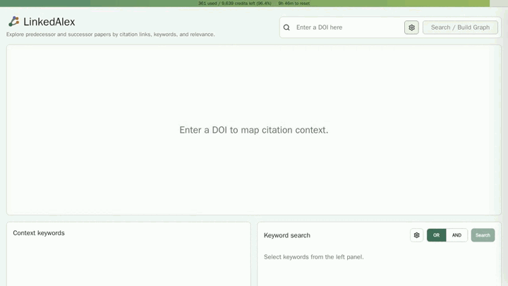

# LinkedAlex

[English](README.md) | [한국어](README.ko.md)



LinkedAlex는 OpenAlex API를 사용해 연구 논문 주변의 인용 맥락을 탐색하는 로컬 웹 앱입니다. DOI를 입력해 인용 네트워크를 만들고, 선행/후행 논문을 살펴보며, 문맥 키워드로 논문을 검색하고, 그래프에 표시된 논문 정보를 JSON 또는 CSV로 내보낼 수 있습니다.

LinkedAlex는 OpenAlex 데이터를 사용하며, OpenAlex의 공식 서비스는 아닙니다.

## 1. 프로젝트 개요

LinkedAlex는 특정 논문이 이전 연구 및 이후 연구와 어떻게 연결되는지 이해할 수 있도록 돕습니다.
인용 관계를 논문 네트워크로 구성함으로서, 사용자는 방법론, 논리, 연구 주제가 시간에 따라 어떻게 발전하는지 파악하고, 추가 탐색에 필요한 핵심 키워드와 저널을 확인할 수 있습니다.

- **Target paper**는 DOI로 검색한 기준 논문입니다.
- **Predecessor papers**는 target paper 또는 다른 predecessor paper가 인용한 논문입니다.
- **Successor papers**는 target paper 또는 다른 successor paper를 인용한 논문입니다.
- 논문들은 인터랙티브 네트워크 그래프로 표시됩니다.
- 우측 패널에서 선택한 논문의 상세 메타데이터를 확인할 수 있습니다.
- 그래프 아래에는 Context keywords와 Context journals가 표시됩니다.
- Keyword search로 그래프를 다시 만들지 않고, 관심 키워드와 유사한 논문을 검색할 수 있습니다.
- 그래프에 표시된 논문 메타데이터를 JSON 또는 CSV로 내보낼 수 있습니다.

## 2. 빠른 시작

### 2.1 요구 사항

- Docker Desktop 또는 Docker Engine
- Docker Compose
- OpenAlex API key

### 2.2 API Key 설정

예시 설정 파일을 복사합니다.

```bash
cp config.example.yml config.yml
```

`config.yml`을 열고 OpenAlex API key를 입력합니다.

```yml
openalex:
  api_key: "YOUR_OPENALEX_API_KEY"
```

대부분의 사용자는 `openalex.api_key`만 변경하고, 나머지 설정값은 기본값 그대로 두는 것을 권장합니다.

`config.yml`은 gitignore에 의해 무시되므로 API key가 커밋되지 않습니다.

### 2.3 실행

```bash
docker compose up --build
```

웹브라우저 주소창에 아래 주소를 입력하여 LinkedAlex를 사용할 수 있습니다.

```txt
http://localhost:5173
```

Backend health check:

```txt
http://localhost:8000/api/health
```

`frontend/index.html`을 브라우저에서 직접 열지 마세요. 프론트엔드는 Vite React 앱이므로 개발 서버 또는 Docker 컨테이너를 통해 제공되어야 합니다.

## 3. 사용법

### 3.1 DOI로 Search / Build Graph

상단 검색창에 DOI를 입력하고 **Search / Build Graph** 버튼을 누릅니다.

예시:

```txt
10.1002/suco.202400188
https://doi.org/10.1002/suco.202400188
```

DOI graph 생성은 OpenAlex API를 호출하고 credit을 사용할 수 있으므로, LinkedAlex는 그래프 생성 전에 확인 창을 표시합니다. 검색창 옆의 그래프 설정 버튼에서 아래 값을 조절할 수 있습니다.

- predecessor depth
- successor depth
- 각 단계에서 표시할 논문 수

Depth 3은 더 오래 걸리고 더 많은 OpenAlex credit을 사용할 수 있습니다.

### 3.2 Target, Predecessor, Successor

LinkedAlex는 논문을 세 방향으로 구분합니다.

- **TARGET**: DOI로 검색한 논문입니다.
- **Predecessor**: target paper가 인용했거나 다른 predecessor paper가 인용한 논문입니다.
- **Successor**: target paper를 인용했거나 다른 successor paper를 인용한 논문입니다.

OpenAlex 인용 데이터에는 드물게 비정상적인 연도 메타데이터가 있을 수 있습니다. LinkedAlex는 명확한 연도 역전을 제외합니다.

- parent paper보다 늦게 출판된 predecessor paper는 제외합니다.
- parent paper보다 먼저 출판된 successor paper는 제외합니다.
- 출판 연도를 알 수 없는 논문은 유지합니다.

### 3.3 그래프 조작

그래프는 인터랙티브하게 사용할 수 있습니다.

- 빈 그래프 공간을 드래그하면 화면을 이동할 수 있습니다.
- 그래프 우측 상단의 zoom control을 사용할 수 있습니다.
- 논문 노드를 클릭하면 우측 정보 패널이 열립니다.
- 선택된 노드는 점멸 표시됩니다.
- 선택된 노드와 직접 연결된 predecessor/successor 노드는 서로 다른 색으로 강조됩니다.
- 이미 가져온 OpenAlex 메타데이터에서 인용 관계가 확인되는 경우, 그래프에 표시된 논문 사이에 링크가 그려집니다.

그래프 링크는 그래프 생성 이후 추가 API 호출 없이 표시됩니다.

### 3.4 좌측 연도별 패널

좌측 슬라이딩 패널은 publication year별 키워드를 보여줍니다. 최신 연도가 위쪽에 표시됩니다.

- 화살표 버튼으로 연도별 패널을 열고 닫을 수 있습니다.
- 연도별 키워드를 클릭하면 해당 키워드를 포함한 그래프 노드가 강조됩니다.
- 여러 키워드를 선택할 수 있습니다.
- 화살표 아래의 톱니바퀴 버튼에서 강조 조건을 **OR** 또는 **AND**로 설정할 수 있습니다.
- 톱니바퀴 아래의 export 버튼에서 그래프 내보내기 옵션을 열 수 있습니다.

연도별 키워드 강조는 그래프에만 적용됩니다. Keyword search 조건에는 추가되지 않습니다.

### 3.5 Context Keywords와 Keyword Search

그래프 아래의 **Context keywords**는 현재 그래프에 이미 로드된 논문에서 추출한 주요 키워드를 보여줍니다. 항목은 방향과 단계별로 묶이며, 해당 키워드를 포함한 논문 수가 많은 순으로 정렬됩니다.

표시 형식:

```txt
keyword | count
```

Context keyword를 클릭하면 Keyword search에 추가됩니다. 선택된 키워드를 다시 클릭하면 제거됩니다.

Keyword search는 아래 기능을 지원합니다.

- 여러 키워드 선택
- **OR** / **AND** 검색 모드
- 검색 결과 수 제한 설정
- OpenAlex 호출 전 확인 창
- 결과 논문 제목 클릭 시 그래프를 재생성하지 않고 우측 패널만 갱신

Keyword search 결과는 현재 citation graph와 별개입니다. 결과를 선택하면 우측 패널만 업데이트됩니다.

### 3.6 Context Journals

**Context journals**는 Context keywords 아래에 표시됩니다. 현재 그래프에 이미 로드된 논문의 저널 정보를 사용합니다.

표시 형식:

```txt
journal | count
```

저널도 Context keywords와 같은 방식으로 그룹화되며, 해당 저널에서 출판된 논문 수가 많은 순으로 정렬됩니다. Journal chip은 표시 전용이며 Keyword search를 실행하지 않습니다.

### 3.7 우측 정보 패널

그래프 노드 또는 Keyword search 결과를 클릭하면 우측 정보 패널이 열립니다.

패널에는 아래 정보가 표시됩니다.

- title
- authors
- year and journal
- citation count
- DOI
- Open paper link
- keywords
- abstract

패널은 최근에 본 논문에 대한 back/forward 이동도 지원합니다.

선택한 논문에 DOI가 있으면 패널 하단에 **Search / Build Graph** 버튼이 표시됩니다. 이 버튼을 누르면 현재 그래프와 선택된 keyword context가 교체되므로 확인 창이 표시됩니다.

### 3.8 그래프 논문 내보내기

그래프가 생성된 후 좌측 연도별 패널 컨트롤 근처의 export 아이콘을 누릅니다.

지원 형식:

- JSON
- CSV

내보내는 필드:

- `TITLE`
- `AUTHORS`
- `YEAR`
- `JOURNAL`
- `CITATIONS`
- `DOI`
- `KEYWORDS`
- `ABSTRACT`

CSV export는 Windows Excel에서 인코딩을 더 안정적으로 인식할 수 있도록 UTF-8 with BOM을 사용합니다.

내보내기는 그래프에 이미 표시된 논문만 사용합니다. OpenAlex를 다시 호출하지 않습니다.

## 4. OpenAlex Usage Bar

앱 최상단의 얇은 bar는 설정된 API key의 OpenAlex credit 사용량을 보여줍니다.

표시 형식:

```txt
used / credits left (remaining %)
```

백엔드는 OpenAlex API 응답에서 아래 rate limit header를 읽습니다.

- `X-RateLimit-Limit`
- `X-RateLimit-Remaining`
- `X-RateLimit-Credits-Used`
- `X-RateLimit-Reset`

프론트엔드는 백엔드 응답에 usage state가 포함될 때마다 usage bar를 갱신합니다. `/api/usage` endpoint는 앱 최초 로딩 시 사용됩니다.

## 5. 네트워크 생성 메커니즘

### 5.1 Graph Expansion

DOI graph를 만들 때 LinkedAlex는 target paper에서 시작하여 두 방향으로 확장합니다.

Predecessor 방향:

```txt
target -> target이 인용한 논문 -> 그 논문들이 인용한 논문 -> ...
```

Successor 방향:

```txt
target -> target을 인용한 논문 -> 그 논문들을 인용한 논문 -> ...
```

각 단계에서 LinkedAlex는 citation count 기준으로 제한된 수의 논문만 표시합니다. 기본값은 아래와 같습니다.

```txt
Step 1: 10
Step 2: 5
Step 3: 2
```

이 값은 그래프 설정 창에서 조절할 수 있습니다.

### 5.2 Relevance Score

LinkedAlex는 그래프 생성을 통해 이미 불러온 노드들의 메타데이터만 사용하여 고정 relevance score를 계산하고, 이 점수로 논문 노드들의 위치를 정합니다.

```txt
layout_score =
  0.40 * reference_overlap
+ 0.25 * local_cocitation
+ 0.20 * keyword_overlap
+ 0.10 * citation_score
+ 0.05 * author_overlap
```

Score component:

- `reference_overlap`: target paper와 공유하는 reference 수를 target reference 수로 나눈 값입니다.
- `local_cocitation`: 이미 가져온 successor paper 중 target과 candidate paper를 모두 인용한 논문의 비율입니다.
- `keyword_overlap`: 정규화된 keyword/concept의 겹침 정도입니다.
- `citation_score`: 현재 그래프 안에서 log-normalized citation count입니다.
- `author_overlap`: target과 candidate paper가 하나 이상의 OpenAlex author ID를 공유할 때 주는 작은 보너스입니다.

이 점수는 현재 그래프 내부에서만 의미가 있습니다. 모든 논문에 대한 보편적인 유사도 점수가 아닙니다.

### 5.3 Node Distance

Target paper는 중앙 근처에 배치됩니다.

- `layout_score`가 높을수록 target에 더 가깝게 배치됩니다.
- `layout_score`가 낮을수록 target에서 더 멀리 배치됩니다.
- Predecessor paper는 왼쪽에 유지됩니다.
- Successor paper는 오른쪽에 유지됩니다.
- Publication year는 노드에 표시되고 데이터 검증에 사용됩니다.

프론트엔드는 노드 박스가 과도하게 겹치지 않도록 local collision-relaxation을 수행합니다. 표시된 node pair를 검사하고, target을 고정한 상태에서 겹치는 노드를 밀어냅니다.

### 5.4 Links

표시된 논문 중 한 논문이 다른 표시 논문을 reference로 포함하면 링크가 그려집니다. 이 작업은 이미 가져온 OpenAlex work object의 `referenced_works` 메타데이터를 사용합니다.

LinkedAlex는 현재 그래프에 표시된 논문 사이의 링크만 그리므로, 그래프 edge를 위해 추가 API 호출을 하지 않습니다.

## 6. 설정

주요 설정은 `config.yml`에 있습니다.
대부분의 사용자는 `openalex.api_key`만 변경하는 것을 권장합니다. 나머지 값은 조정된 기본값입니다.

```yml
openalex:
  api_key: "YOUR_OPENALEX_API_KEY"
  base_url: "https://api.openalex.org"
  timeout_seconds: 20
  max_retries: 3
  requests_per_second: 5
  max_referenced_works_per_paper: 60

graph:
  predecessor:
    max_depth: 2
    limits_by_depth:
      1: 10
      2: 5
      3: 2
  successor:
    max_depth: 2
    limits_by_depth:
      1: 10
      2: 5
      3: 2
  sort_by: "cited_by_count"

cache:
  enabled: true
  ttl_seconds: 86400

app:
  backend_host: "0.0.0.0"
  backend_port: 8000
  frontend_port: 5173
```

설정 항목:

| Field | Description |
| --- | --- |
| `openalex.api_key` | 사용자의 OpenAlex API key입니다. `config.yml`에서 `YOUR_OPENALEX_API_KEY`를 교체하세요. |
| `openalex.base_url` | OpenAlex API base URL입니다. OpenAlex endpoint가 바뀌지 않는 한 기본값을 유지하세요. |
| `openalex.timeout_seconds` | 단일 OpenAlex 요청을 기다리는 최대 시간입니다. |
| `openalex.max_retries` | 일시적인 OpenAlex 요청 실패 후 재시도 횟수입니다. |
| `openalex.requests_per_second` | OpenAlex 요청에 대한 client-side pacing limit입니다. |
| `openalex.max_referenced_works_per_paper` | 각 OpenAlex work object에서 유지할 referenced works의 최대 수입니다. |
| `graph.predecessor.max_depth` | predecessor 방향의 최대 확장 깊이입니다. 유효 범위는 `0`부터 `3`까지입니다. |
| `graph.predecessor.limits_by_depth` | 각 predecessor step에서 표시할 최대 논문 수입니다. citation count 기준으로 선택됩니다. |
| `graph.successor.max_depth` | successor 방향의 최대 확장 깊이입니다. 유효 범위는 `0`부터 `3`까지입니다. |
| `graph.successor.limits_by_depth` | 각 successor step에서 표시할 최대 논문 수입니다. citation count 기준으로 선택됩니다. |
| `graph.sort_by` | 각 graph step에서 논문을 선택할 때 사용하는 ranking field입니다. |
| `cache.enabled` | 반복 API 호출을 줄이기 위한 OpenAlex response cache 사용 여부입니다. |
| `cache.ttl_seconds` | Cache lifetime입니다. `86400`은 1일입니다. |
| `app.backend_host` | 컨테이너 내부 backend bind host입니다. |
| `app.backend_port` | Backend API port입니다. |
| `app.frontend_port` | Frontend web app port입니다. |

Docker 설정은 OpenAlex response cache를 `backend-cache`라는 Docker volume에 저장합니다.

## 7. 로컬 개발

Backend:

```bash
cd backend
python3 -m venv .venv
source .venv/bin/activate
pip install -r requirements.txt
PYTHONPATH=. uvicorn app.main:app --reload
```

Frontend:

```bash
cd frontend
npm install
npm run dev
```

Production-style Docker run:

```bash
docker compose up --build
```

## 8. 기술 스택

Backend:

- Python
- FastAPI
- httpx
- Pydantic
- PyYAML
- diskcache

Frontend:

- React
- TypeScript
- Vite
- TanStack Query
- React Flow
- Zustand
- lucide-react

Infrastructure:

- Docker
- Docker Compose

## 9. 라이선스와 데이터

LinkedAlex는 MIT License로 배포됩니다.

OpenAlex 데이터는 CC0입니다. OpenAlex API 및 데이터에 대한 자세한 내용은 OpenAlex 문서를 참고하세요.

```txt
https://docs.openalex.org/
```
