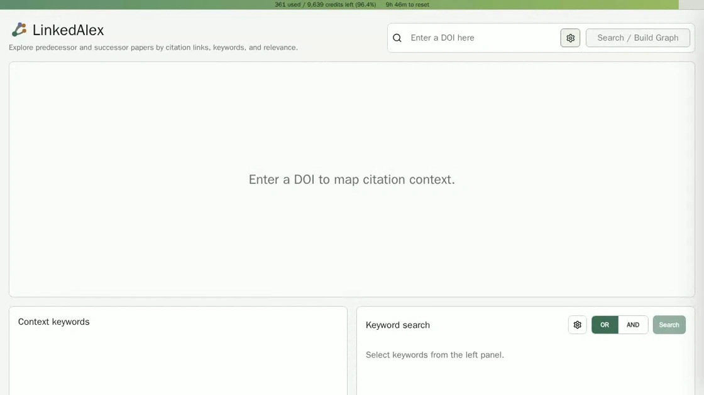

# LinkedAlex

[English](README.md) | [한국어](README.ko.md)



LinkedAlex is a local web app for snowball-style citation exploration around a research paper using the OpenAlex API. Enter a DOI, build a forward and backward citation graph, inspect predecessor and successor papers, search by contextual keywords, and export the papers shown in the graph.

LinkedAlex uses OpenAlex data, but it is not affiliated with OpenAlex.

## 0. Use Cases

LinkedAlex can be used to explore citation contexts and research trajectories around a paper or topic.

1. Analyze a highly cited methodology paper A to investigate the mathematical foundations behind the methodology, including predecessor studies, and its applications in successor studies.
2. Analyze a key predecessor paper to reverse-engineer or improve its approach, while tracking successor studies to see how the research direction develops.
3. Identify the journals where papers in a field of interest are commonly published.
4. Identify the keywords that describe a research area of interest, then use those keywords in the **Keyword Search** section with AND/OR conditions to find additional papers not captured in the graph and regenerate the graph from those papers.
5. Use paper metadata exported as CSV or JSON as input to an LLM for more detailed questions and responses with reduced hallucination.
   - Ask why paper A cited papers B-Z based on the exported citation context.
   - Use DOI values to collect full-text sources, then provide the full texts as input to ask detailed questions not answered by abstracts, such as common methodologies used across the papers.

## 1. Project Overview

LinkedAlex helps users understand how a target paper is connected to earlier and later literature.

By organizing citation relationships into a paper network, LinkedAlex helps users quickly trace how methods, arguments, and research topics develop over time, while identifying key keywords and journals for further exploration.

- A **target paper** is searched by DOI.
- **Predecessor papers** are works cited by the target paper or by other predecessor papers.
- **Successor papers** are works that cite the target paper or cite other successor papers.
- Papers are displayed as an interactive network graph.
- The right panel shows detailed metadata for the selected paper.
- Context keywords and journals are extracted from the graph and shown below the graph.
- Keyword search can find additional OpenAlex papers without rebuilding the graph.
- Graph paper metadata can be exported as JSON or CSV.

## 2. Quick Start

### 2.1 Requirements

- [Docker Desktop or Docker Engine](https://docs.docker.com/get-started/get-docker/)
- [Docker Compose](https://docs.docker.com/compose/install/)
- [OpenAlex API key](https://developers.openalex.org/api-reference/authentication)

### 2.2 Configure API Key

Copy the example config file:

```bash
cp config.example.yml config.yml
```

Edit `config.yml` and enter your OpenAlex API key:

```yml
openalex:
  api_key: "YOUR_OPENALEX_API_KEY"
```

OpenAlex follows the open infrastructure principle of ["We sell services, not data."](https://openscholarlyinfrastructure.org/).
Therefore, a free OpenAlex API key is enough to use LinkedAlex's search, data retrieval, and related features.

For most users, it is recommended to change only `openalex.api_key` and keep the other settings at their default values.

`config.yml` is ignored by git so your API key is not committed.

### 2.3 Run

```bash
docker compose up --build
```

Enter the following address in your web browser to use LinkedAlex:

```txt
http://localhost:5173
```

Backend health check:

```txt
http://localhost:8000/api/health
```

Do not open `frontend/index.html` directly. The frontend is a Vite React app and must be served through the dev server or Docker container.

## 3. How To Use

### 3.1 Search / Build Graph By DOI

Enter a DOI in the top search box and click **Search / Build Graph**.

Examples:

```txt
10.1002/suco.202400188
https://doi.org/10.1002/suco.202400188
```

Before building the graph, LinkedAlex shows a confirmation dialog because DOI graph generation calls the OpenAlex API and may consume credits. The graph settings button next to the search box lets you adjust:

- predecessor depth
- successor depth
- number of papers displayed at each step

Depth 3 can take longer and consume more OpenAlex credits.

### 3.2 Target, Predecessor, And Successor

LinkedAlex uses three paper directions:

- **TARGET**: the paper searched by DOI.
- **Predecessor**: a paper cited by the target paper or cited by another predecessor paper.
- **Successor**: a paper that cites the target paper or cites another successor paper.

OpenAlex citation data can occasionally contain unusual metadata. LinkedAlex removes clear year reversals:

- predecessor papers published later than their parent paper are excluded
- successor papers published earlier than their parent paper are excluded
- papers with unknown publication years are kept

### 3.3 Graph Interaction

The graph is interactive:

- Drag empty graph space to pan.
- Use zoom controls in the top-right of the graph.
- Click a paper node to open it in the right information panel.
- The selected node pulses.
- Directly linked predecessor and successor nodes are highlighted with different colors.
- Links are drawn between displayed papers when the citation relationship is known from already fetched OpenAlex metadata.

Graph links do not require extra API calls after the graph is built.

### 3.4 Left Year Panel

The left sliding panel groups keywords by publication year. Newer years are shown toward the top.

- Click the arrow button to open or close the year panel.
- Click a year keyword to highlight graph nodes containing that keyword.
- Multiple keywords can be selected.
- The gear button below the arrow controls whether highlighting uses **OR** or **AND** logic.
- The export button below the gear opens graph export options.

Year keyword highlighting affects the graph only. It does not add terms to Keyword search.

### 3.5 Context Keywords And Keyword Search

Below the graph, **Context keywords** shows important keywords extracted from papers already loaded in the graph. Items are grouped by direction and step, and sorted by the number of papers that contain the keyword.

Format:

```txt
keyword | count
```

Clicking a context keyword adds it to Keyword search. Clicking the selected keyword again removes it.

Keyword search supports:

- multiple selected keywords
- **OR** / **AND** search mode
- result limit setting
- confirmation before calling OpenAlex
- selecting a result title to open it in the right panel without rebuilding the graph

Keyword search results are separate from the current citation graph. Selecting a result updates the right panel only.

### 3.6 Context Journals

**Context journals** is shown under Context keywords. It uses the journals of papers already loaded in the graph.

Format:

```txt
journal | count
```

Journals are grouped in the same way as context keywords and sorted by the number of papers from that journal. Journal chips are display-only and do not trigger Keyword search.

### 3.7 Right Information Panel

Clicking a graph node or a Keyword search result opens the right information panel.

The panel shows:

- title
- authors
- year and journal
- citation count
- DOI
- Open paper link
- keywords
- abstract

The panel also supports back and forward navigation through recently viewed papers.

If the selected paper has a DOI, the panel shows **Search / Build Graph** at the bottom. Clicking it asks for confirmation because it replaces the current graph and selected keyword context.

### 3.8 Export Graph Papers

After a graph is built, click the export icon near the left year panel controls.

Supported formats:

- JSON
- CSV

Exported fields:

- `TYPE`
- `DEPTH_LEVEL`
- `TITLE`
- `AUTHORS`
- `YEAR`
- `JOURNAL`
- `CITATIONS`
- `DOI`
- `KEYWORDS`
- `ABSTRACT`

`TYPE` is one of `TARGET`, `PREDECESSOR`, or `SUCCESSOR`. `DEPTH_LEVEL` is the graph depth from the target paper: target is `0`, first-level papers are `1`, second-level papers are `2`, and so on.

CSV export uses UTF-8 with BOM so that Windows Excel can detect the encoding more reliably.

The export uses only papers already shown in the graph. It does not call OpenAlex again.

## 4. OpenAlex Usage Bar

The thin bar at the top of the app shows OpenAlex credit usage for the configured API key.

It displays:

```txt
used / credits left (remaining %)
```

The backend reads OpenAlex rate limit headers from API responses:

- `X-RateLimit-Limit`
- `X-RateLimit-Remaining`
- `X-RateLimit-Credits-Used`
- `X-RateLimit-Reset`

The frontend updates the usage bar whenever backend responses include updated usage state. The `/api/usage` endpoint is used when the app first loads.

## 5. Network Generation Mechanism

### 5.1 Graph Expansion

When a DOI graph is built, LinkedAlex starts from the target paper and expands in two directions.

Predecessor direction:

```txt
target -> papers cited by target -> papers cited by those papers -> ...
```

Successor direction:

```txt
target -> papers citing target -> papers citing those papers -> ...
```

At each step, LinkedAlex keeps a limited number of papers selected by citation count. Default limits are:

```txt
Depth Level 1: 10
Depth Level 2: 5
Depth Level 3: 2
```

These limits are configurable in the graph settings popover.

### 5.2 Relevance Score

LinkedAlex places papers using a fixed relevance score calculated from metadata already fetched during graph generation.

```txt
layout_score =
  0.40 * reference_overlap
+ 0.25 * local_cocitation
+ 0.20 * keyword_overlap
+ 0.10 * citation_score
+ 0.05 * author_overlap
```

Score components:

- `reference_overlap`: how many references are shared with the target paper, divided by the target reference count.
- `local_cocitation`: how often already fetched successor papers cite both the target and the candidate paper.
- `keyword_overlap`: overlap between normalized keywords/concepts.
- `citation_score`: log-normalized citation count within the current graph.
- `author_overlap`: small bonus when the target and candidate share at least one OpenAlex author ID.

The score is local to the current graph. It is not a universal paper similarity score.

### 5.3 Node Distance

The target paper is placed near the center.

- Higher `layout_score` means the paper is placed closer to the target.
- Lower `layout_score` means the paper is placed farther away.
- Predecessor papers stay on the left side.
- Successor papers stay on the right side.
- Publication year is shown on nodes and used for validation, but it no longer fixes the x-axis position.

The frontend then runs a local collision-relaxation step so paper boxes do not overlap as much. This checks displayed node pairs and pushes overlapping nodes apart while keeping the target fixed.

### 5.4 Links

Links are drawn between displayed papers when one paper references another displayed paper. This uses `referenced_works` metadata already present in fetched OpenAlex work objects.

Because LinkedAlex only draws links among papers currently displayed in the graph, it does not need extra API calls for graph edges.

## 6. Configuration

Main settings live in `config.yml`.

For most users, only `openalex.api_key` should be changed. The other values are tuned defaults.

```yml
openalex:
  api_key: "YOUR_OPENALEX_API_KEY"
  base_url: "https://api.openalex.org"
  timeout_seconds: 20
  max_retries: 3
  requests_per_second: 5
  max_referenced_works_per_paper: 60

graph:
  predecessor:
    max_depth: 2
    limits_by_depth:
      1: 10
      2: 5
      3: 2
  successor:
    max_depth: 2
    limits_by_depth:
      1: 10
      2: 5
      3: 2
  sort_by: "cited_by_count"

cache:
  enabled: true
  ttl_seconds: 86400

app:
  backend_host: "0.0.0.0"
  backend_port: 8000
  frontend_port: 5173
```

Configuration fields:

| Field | Description |
| --- | --- |
| `openalex.api_key` | Your OpenAlex API key. Replace `YOUR_OPENALEX_API_KEY` in `config.yml`. |
| `openalex.base_url` | OpenAlex API base URL. Keep the default unless OpenAlex changes its endpoint. |
| `openalex.timeout_seconds` | Maximum seconds to wait for a single OpenAlex request. |
| `openalex.max_retries` | Retry attempts after transient OpenAlex request failures. |
| `openalex.requests_per_second` | Client-side pacing limit for OpenAlex requests. |
| `openalex.max_referenced_works_per_paper` | Maximum referenced works kept from each OpenAlex work object. |
| `graph.predecessor.max_depth` | Maximum predecessor expansion depth. Valid range is `0` to `3`. |
| `graph.predecessor.limits_by_depth` | Maximum predecessor papers displayed at each step, selected by citation count. |
| `graph.successor.max_depth` | Maximum successor expansion depth. Valid range is `0` to `3`. |
| `graph.successor.limits_by_depth` | Maximum successor papers displayed at each step, selected by citation count. |
| `graph.sort_by` | Ranking field used when selecting papers at each graph step. |
| `cache.enabled` | Enables local OpenAlex response caching to reduce repeated API calls. |
| `cache.ttl_seconds` | Cache lifetime in seconds. `86400` equals 1 day. |
| `app.backend_host` | Backend bind host inside the container. |
| `app.backend_port` | Backend API port. |
| `app.frontend_port` | Frontend web app port. |

The Docker setup stores OpenAlex response cache in a Docker volume named `backend-cache`.

## 7. Local Development

Backend:

```bash
cd backend
python3 -m venv .venv
source .venv/bin/activate
pip install -r requirements.txt
PYTHONPATH=. uvicorn app.main:app --reload
```

Frontend:

```bash
cd frontend
npm install
npm run dev
```

Production-style Docker run:

```bash
docker compose up --build
```

## 8. Tech Stack

Backend:

- Python
- FastAPI
- httpx
- Pydantic
- PyYAML
- diskcache

Frontend:

- React
- TypeScript
- Vite
- TanStack Query
- React Flow
- Zustand
- lucide-react

Infrastructure:

- Docker
- Docker Compose

## 9. License And Data

LinkedAlex is released under the MIT License.

OpenAlex data is CC0. See OpenAlex documentation for API and data details:

```txt
https://docs.openalex.org/
```
